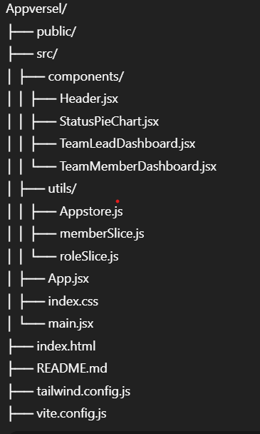

# ⚡ Team Pulse Dashboard

An interactive dashboard where a Team Lead can manage members, assign tasks, monitor statuses, and a Team Member can track their own progress — built with React, Redux Toolkit, and Tailwind CSS.

---

## 🚀 Live Demo

🔗 https://appversel.vercel.app/


## 🧠 Features

### 👥 Role-Based Dashboard
- Switch between **Team Lead** and **Team Member**
- Role state is managed via Redux

### 🧑‍💼 Team Lead View
- View all team members
- Assign tasks with title & due date
- Filter by status (Working, Break, Meeting, Offline)
- Sort by active tasks
- Pie chart showing status breakdown

### 👨‍💻 Team Member View
- Update current status
- View and manage assigned tasks
- Progress bar for each task
- Mark as completed at 100%

---

## 🧩 Bonus Challenges Implemented

- ✅ **Bonus Challenge 2**: Pie Chart using Chart.js
- ✅ **Bonus Challenge 3**: Dark Mode Toggle using Tailwind

---

## 🛠 Tech Stack

- ⚛️ React + Vite
- 🧠 Redux Toolkit
- 🎨 Tailwind CSS
- 📊 Chart.js (`react-chartjs-2`)
- 🧪 randomuser.me (for dummy users)

---

## 📂 Folder Structure


##  Installation
```bash
git clone https://github.com/shivam9198/Appversel
cd appversel
npm install
npm run dev